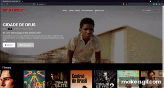

  
   
  O Brasileiroflix é uma releitura da interface de streaming Netflix.

  

  Este foi um projeto desenvolvido durante o Bootcamp Santander, através da plataforma da Digital Innovation One (DIO) com apoio do Felipe Aguiar 🤩.

  Ele propos que utilizasemos o Owl-Carrousel para a criação do carosel de filmes infinito e deixou a missão de usarmos a imaginação para trazer uma interface mais confortável e familiar para o usuário.

  Além do planejado, apliquei o Bideo.js, que é uma biblioteca super simples pra utilizar videos como background em fullscreen. Isso torna a aplicação muito mais interativa e chama atua como um "cativador".

  Adicionei um modal com interação ao clicar no botão INFORMAÇÕES. Em relação ao JavaScript, não houve muito trabalho até o momento. Pretendo melhora-lo futuramente e adicionar novas funcionalidades, como um foco nos filmes do carrousel.

  Caso tenha alguma ideia interessante, sinta-se a vontade para fazer um request 🌞.

